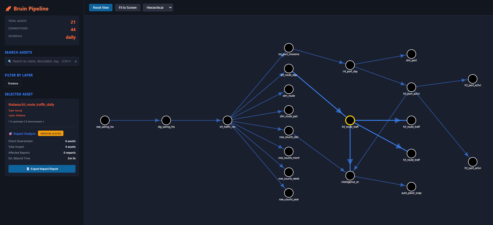
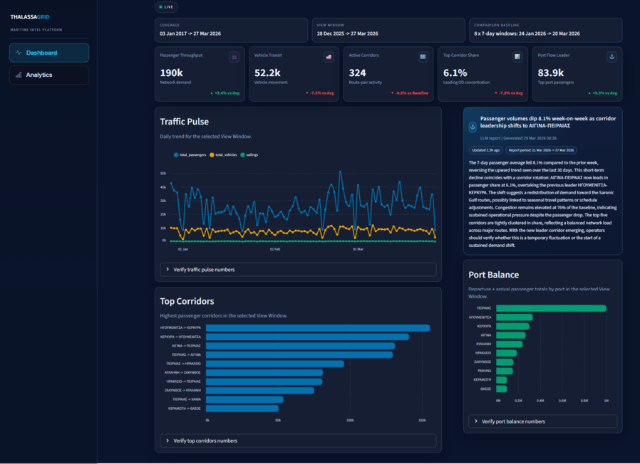
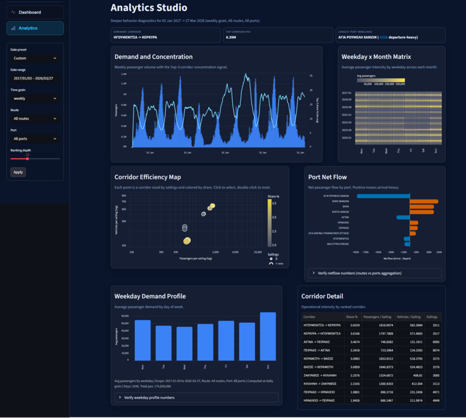
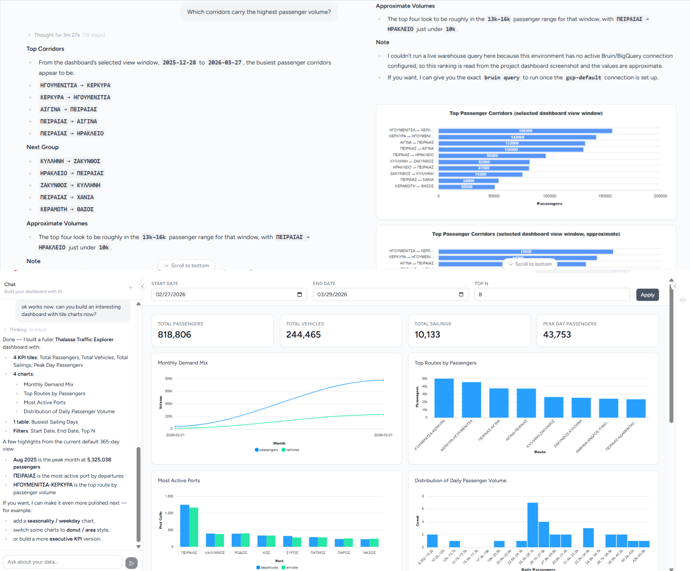

# Thalassa

[](https://www.python.org/)
[](https://getbruin.com/)
[](https://thalassa.streamlit.app/)
[](https://cloud.google.com/bigquery)
[](https://cloud.google.com/)
[](https://www.terraform.io/)

Thalassa is a production-style batch data engineering project for Greek maritime traffic analytics. It ingests public sailing traffic data from the `data.gov.gr` `sailing_traffic` API, lands the raw records in BigQuery, transforms them into curated analytics tables with Bruin, and serves a Streamlit dashboard with both operational KPIs and deeper route/port analysis.

This repository is written to satisfy the spirit of the DE Zoomcamp course project: pick a real dataset, build an end-to-end pipeline, transform the data in a cloud warehouse, and expose it through a dashboard that is easy for reviewers to reproduce.

## Table of contents

- [Thalassa](#thalassa)
  - [Table of contents](#table-of-contents)
  - [Repository layout](#repository-layout)
  - [Quick start](#quick-start)
  - [Problem statement and Dataset](#problem-statement-and-dataset)
    - [Dataset](#dataset)
  - [Course project requirements mapping](#course-project-requirements-mapping)
  - [Architecture](#architecture)
  - [Step-by-step reproduction](#step-by-step-reproduction)
    - [Clone the repository](#clone-the-repository)
    - [Install Python dependencies](#install-python-dependencies)
    - [Create or choose a GCP project](#create-or-choose-a-gcp-project)
    - [Authenticate to Google Cloud](#authenticate-to-google-cloud)
    - [Configure Bruin](#configure-bruin)
    - [Choose a setup path](#choose-a-setup-path)
      - [One-click setup (recommended)](#one-click-setup-recommended)
      - [Manual setup](#manual-setup)
    - [Run the initial backfill](#run-the-initial-backfill)
    - [Launch the dashboard](#launch-the-dashboard)
    - [Optional: visualize the pipeline DAG](#optional-visualize-the-pipeline-dag)
    - [Change the dataset later](#change-the-dataset-later)
    - [Validate manually](#validate-manually)
    - [Optional: regenerate intelligence snapshots directly](#optional-regenerate-intelligence-snapshots-directly)
    - [Verify that the run worked](#verify-that-the-run-worked)
    - [Delete the GCP resources](#delete-the-gcp-resources)
  - [Dashboard](#dashboard)
  - [Using AI on Bruin Cloud UI](#using-ai-on-bruin-cloud-ui)
  - [Future improvements](#future-improvements)
  - [Contributing](#contributing)

## Repository layout

- `.bruin.yml.example`: Bruin connection config template
- `.env.example`: local environment template
- `.streamlit/`: copy `secrets.toml.example` to `secrets.toml` for service account auth
- `dashboard/`: Streamlit dashboard
- `infra/`: Terraform for GCP foundation
- `notebooks/`: exploration notebooks
- `pipeline/`: Bruin pipeline
- `pyproject.toml`: Python project and dependency definitions
- `runtime_config.py`: shared runtime configuration helpers
- `scripts/`: operational helpers — dataset sync, snapshot generation, parity checks
- `uv.lock`: locked dependency versions

## Quick start

1. [Clone the repository](#clone-the-repository) and run `uv sync` (or `uv sync --extra local` for dashboard + notebooks).
2. Complete [Authenticate to Google Cloud](#authenticate-to-google-cloud).
3. Run the setup flow in [Choose a setup path](#choose-a-setup-path). If the dataset and infrastructure already exist, use the local-only switch in [Change the dataset later](#change-the-dataset-later) instead.
4. [Run the initial backfill](#run-the-initial-backfill).
5. [Launch the dashboard](#launch-the-dashboard).

## Problem statement and Dataset

Greek coastal traffic data is publicly available, but it is not immediately usable for analytics. Raw API responses are noisy, schema-light, and difficult to compare across time, ports, and routes.

This project answers questions such as:

- Which corridors carry the highest passenger volume?
- Which ports are the busiest over time?
- How do passenger and vehicle volumes change daily, weekly, and monthly?
- Is traffic concentrating in a few corridors?
- Which ports are arrival-heavy or departure-heavy in a given window?

To answer those questions reliably, the project builds a repeatable batch pipeline with explicit quality checks, curated warehouse models, and a dashboard backed by stable fact tables instead of ad hoc raw queries.

### Dataset

- Source: [`data.gov.gr` `sailing_traffic` API](https://www.data.gov.gr/datasets/sailing_traffic/)
- Domain: Greek maritime passenger and vehicle traffic
- Pipeline interpretation: the source is modeled as reported traffic observations by service date, route code, departure port, and arrival port
- Analytics outcome: curated route- and port-level warehouse tables for dashboarding


## Course project requirements mapping

| Course area | How this repo addresses it |
| --- | --- |
| Problem description | Clear business problem around Greek sailing traffic demand, corridor concentration, and port activity |
| Cloud | GCP is used for the warehouse and supporting cloud resources |
| IaC | Terraform in `infra/` provisions the BigQuery dataset, IAM, Secret Manager, and optional Artifact Registry |
| Data ingestion | Batch ingestion from the public API using a Bruin Python asset |
| Workflow orchestration | Bruin manages dependencies, scheduling, variables, and downstream execution |
| Data warehouse | BigQuery is the canonical warehouse |
| Warehouse optimization | Partitioning and clustering are defined in the Bruin model metadata |
| Transformations | SQL models are organized into staging, intermediate, marts, and reports |
| Dashboard | Streamlit dashboard includes temporal and categorical analysis tiles |
| Reproducibility | Full step-by-step setup and run instructions are included below |

## Architecture

See [docs/architecture.md](docs/architecture.md) for diagrams, pipeline details, tech stack, warehouse layers, partitioning, and data quality checks.


## Step-by-step reproduction

> [!TIP]
> Commands shown use Bash/Linux syntax. PowerShell alternatives are available in collapsibles where the commands differ.

> [!IMPORTANT]
> Required tools:
> 
> You need these tools available in your shell:
> 
> - Python 3.11+
> - `uv`
> - `bruin`
> - `terraform`
> - `gcloud`


### Clone the repository

```bash
git clone https://github.com/dimzachar/thalassa-analytics.git
cd thalassa-analytics
```

### Install Python dependencies

Install core dependencies only:

```bash
uv sync
```

Install with the Streamlit dashboard and DuckDB local mirror:

```bash
uv sync --extra dashboard
```

Install with Jupyter notebooks support:

```bash
uv sync --extra notebooks
```

Install everything (dashboard + notebooks + DuckDB):

```bash
uv sync --extra local
```

### Create or choose a GCP project

You need a GCP project with billing enabled.

At minimum, the project must support:

- BigQuery
- IAM
- Secret Manager
- Service Usage
- optional Artifact Registry

### Authenticate to Google Cloud

The simplest local path is Application Default Credentials.

```bash
gcloud auth application-default login
gcloud auth application-default set-quota-project YOUR_GCP_PROJECT
```

Replace `YOUR_GCP_PROJECT` with your real GCP project ID.

Alternative: use a service account JSON file and export one of these variables:

Linux/macOS:

```bash
export GOOGLE_APPLICATION_CREDENTIALS=/absolute/path/to/key.json
# or
export THALASSA_GCP_SERVICE_ACCOUNT_FILE=/absolute/path/to/key.json
```

<details>
<summary>Windows (PowerShell):</summary>

```powershell
$env:GOOGLE_APPLICATION_CREDENTIALS = "C:\absolute\path\to\key.json"
# or
$env:THALASSA_GCP_SERVICE_ACCOUNT_FILE = "C:\absolute\path\to\key.json"
```
</details>

For Streamlit specifically, you can also copy `.streamlit/secrets.toml.example` to `.streamlit/secrets.toml` and fill in the service account values.

### Configure Bruin

If you do not already have a local `.bruin.yml`, create it from the example first.

Linux/macOS:

```bash
cp .bruin.yml.example .bruin.yml
```

<details>
<summary>Windows (PowerShell):</summary>

```powershell
Copy-Item .bruin.yml.example .bruin.yml
```
</details>


Then update `.bruin.yml` so the `gcp-default` connection points to your project.

<details>
<summary>Minimal example:</summary>

```yaml
default_environment: default

environments:
  default:
    connections:
      google_cloud_platform:
        - name: gcp-default
          project_id: YOUR_GCP_PROJECT
          location: EU
          use_application_default_credentials: true
```

Replace `YOUR_GCP_PROJECT` with your real GCP project ID.

</details>

### Choose a setup path

Pick one of these and follow only that one.

#### One-click setup (recommended)

Use this when you want one command to set the dataset, sync Bruin, validate the pipeline, and apply Terraform.
Run the command from the repo root after [Authenticate to Google Cloud](#authenticate-to-google-cloud) is done.
If `.bruin.yml` does not exist yet, the helper creates it from `.bruin.yml.example` automatically.


Linux/macOS:

```bash
./scripts/set_dataset.sh my_dataset --project-id YOUR_GCP_PROJECT --region europe-west1 --bq-location EU --environment prod
```

<details>
<summary>Windows (PowerShell):</summary>

```powershell
.\scripts\set_dataset.ps1 my_dataset -ProjectId YOUR_GCP_PROJECT -Region europe-west1 -BqLocation EU -Environment prod
```
</details>

---

> [!NOTE]
>
><details>
><summary>What this does:</summary>
>
>- creates `.env` from `.env.example` if needed
>- sets `THALASSA_BQ_DATASET`
>- sets `THALASSA_BQ_PROJECT` and `THALASSA_BQ_LOCATION` when you pass them
>- creates `.bruin.yml` from the example if needed
>- updates the `gcp-default` Bruin connection project and location
>- creates `infra/terraform.tfvars` from the example if needed
>- writes `project_id`, `region`, `bq_location`, and `environment`
>- syncs Bruin asset dataset prefixes
>- runs `bruin validate ./pipeline --fast`
>- runs `terraform init`
>- selects or creates a dataset-specific Terraform workspace
>- runs `terraform plan` and `apply`
>
></details>
---

Replace:
- `my_dataset` with the dataset name you want
- `YOUR_GCP_PROJECT` with your real GCP project ID
- Change `europe-west1`, `EU`, and `prod` too if your region, BigQuery location, or environment are different.

The dataset name lives in `.env`. Terraform reads it from `THALASSA_BQ_DATASET`, so you do not need to repeat it in `infra/terraform.tfvars`.
Project-wide Terraform resource names are derived from that dataset too. For example, `my_dataset` becomes a service account like `my-dataset-pipeline` and an Artifact Registry repo like `my-dataset`.

Add `-AutoApprove` in PowerShell or `--auto-approve` in Bash if you want a non-interactive Terraform apply.

#### Manual setup

If you want to control `.env` and Terraform inputs yourself, run these commands from the repo root.

Linux/macOS:

```bash
cp .env.example .env
cp infra/terraform.tfvars.example infra/terraform.tfvars
```

<details>
<summary>Windows (PowerShell):</summary>

```powershell
Copy-Item .env.example .env
Copy-Item infra/terraform.tfvars.example infra/terraform.tfvars
```
</details>

Edit `.env` and set at least:

- `THALASSA_BQ_PROJECT`
- `THALASSA_BQ_DATASET`
- `THALASSA_BQ_LOCATION`

Then edit `infra/terraform.tfvars` and set at least:

- `project_id`
- `region`
- `bq_location`
- `environment`

Then sync Bruin and apply the infrastructure:

```bash
uv run --no-project python ./scripts/sync_bruin_dataset.py
bruin validate ./pipeline --fast
terraform -chdir=infra init
terraform -chdir=infra workspace select dataset-my_dataset || terraform -chdir=infra workspace new dataset-my_dataset
terraform -chdir=infra plan
terraform -chdir=infra apply
```

See more about [what Terraform creates](infra/README.md).

Those AI secret slots are empty placeholders. You do not need to add OpenRouter, Anthropic, or Gemini keys unless you want LLM-generated intelligence text. Without them, the project still runs and falls back to deterministic reporting.

### Run the initial backfill

For a first run, use `--full-refresh`. This is especially important if tables already exist and you want BigQuery partitioning and clustering to match the checked-in model definitions.

```bash
uv run --no-project python ./scripts/sync_bruin_dataset.py
bruin run --full-refresh ./pipeline/assets/ingestion/raw_sailing_traffic.py --downstream --start-date 2025-01-01 --end-date 2025-01-31
```

To backfill a larger date range, use `--var 'request_window_unit="month"'` to batch requests by month instead of day. The API data starts from `2017-01-03`.

```bash
bruin run ./pipeline/assets/ingestion/raw_sailing_traffic.py --downstream --start-date 2017-01-01 --end-date 2023-12-31 --var 'request_window_unit="month"'
```

> [!NOTE]
> The API enforces a 249-day maximum per request window. `month` (max 31 days) is safe. `year` will always fail with a 400.


<details>
<summary>What this does:</summary>


- fetches API data for the selected window
- lands raw rows in `<THALASSA_BQ_DATASET>.raw_sailing_traffic`
- builds staging, intermediate, marts, and report tables
- refreshes `<THALASSA_BQ_DATASET>.intelligence_snapshots`
- triggers the snapshot writer downstream
</details>


### Launch the dashboard

```bash
uv run streamlit run ./dashboard/app.py
```

Open the local Streamlit URL shown in the terminal.

### Optional: visualize the pipeline DAG

Install [Bruin Visualizer](https://pypi.org/project/bruin-visualizer/) ([source](https://github.com/dimzachar/bruin-viz)) for an interactive DAG view with impact analysis and run history:

```bash
uv tool install bruin-visualizer

# Parse the pipeline (generates pipeline_graph.json)
bruin-viz parse ./pipeline

# Open the visualizer at http://localhost:8001
bruin-viz serve
```

To also record run history before serving:

```bash
bruin-viz run ./pipeline --start-date 2025-01-01 --end-date 2025-01-31 --workers 1
bruin-viz parse ./pipeline
bruin-viz serve
```



### Change the dataset later

Once the project is already set up, use the same script to switch datasets.

For a local-only switch without Terraform:

Linux/macOS:

```bash
./scripts/set_dataset.sh my_dataset --skip-terraform
```

<details>
<summary>Windows (PowerShell):</summary>

```powershell
.\scripts\set_dataset.ps1 my_dataset -SkipTerraform
```
</details>

Replace `my_dataset` with the dataset name you want.

If the new dataset also needs Terraform changes applied, rerun the command from [One-click setup (recommended)](#one-click-setup-recommended) without the skip flag.

### Validate manually

```bash
uv run --no-project python ./scripts/sync_bruin_dataset.py
bruin validate ./pipeline --fast
bruin validate ./pipeline
```

### Optional: regenerate intelligence snapshots directly

These commands are useful when you want to refresh only the narrative layer.

```bash
bruin run ./pipeline/assets/reports/intelligence_snapshots.sql --downstream
```

or

```bash
uv run python ./scripts/generate_auto_panel_snapshot.py
```

### Verify that the run worked

At this point you should have:

- BigQuery tables under your configured `THALASSA_BQ_DATASET`
- a dashboard that loads KPI cards and charts successfully
- visible categorical and temporal tiles for course review

A quick warehouse sanity query is:

```sql
SELECT
  MAX(service_date) AS latest_service_date,
  SUM(total_passengers) AS passengers,
  SUM(total_vehicles) AS vehicles
FROM `YOUR_GCP_PROJECT.YOUR_THALASSA_BQ_DATASET.row_counts_daily`;
```

Replace `YOUR_GCP_PROJECT` and `YOUR_THALASSA_BQ_DATASET` with your real values.

### Delete the GCP resources

See more about [how cleanup works](infra/README.md#destroy--cleanup).

```bash
terraform -chdir=infra workspace select dataset-YOUR_THALASSA_BQ_DATASET
terraform -chdir=infra destroy
```

If you want Terraform to delete the dataset contents too:

1. set `dataset_delete_contents_on_destroy = true` in `infra/terraform.tfvars`
2. run `terraform -chdir=infra workspace select dataset-YOUR_THALASSA_BQ_DATASET`
3. run `terraform -chdir=infra destroy`


## Dashboard

The dashboard reads curated BigQuery tables, not raw API payloads. The default view window is the last 90 days, giving an at-a-glance picture of recent traffic.



The main page shows:

- KPI cards for total passengers, total vehicles, active corridors, traffic concentration, and the leading port
- `Traffic Pulse`: a daily trend chart for passengers, vehicles, and sailings over the view window
- `Top Corridors`: a ranked view of the busiest departure-arrival pairs by passenger volume
- `Port Balance`: a ranked view of the busiest ports by total passenger flow
- (Optional) A cached intelligence panel backed by `<THALASSA_BQ_DATASET>.intelligence_snapshots` — see [docs/agent_panel.md](docs/agent_panel.md) for how the snapshot pipeline, LLM gating, and fallback logic work 



The Analytics page lets users filter by date range, port, and corridor to explore:

- weekday traffic profile
- corridor concentration over time
- corridor efficiency metrics
- port net flow (arrivals vs departures)

This means the course dashboard requirement is covered by at least:

- one temporal tile: `Traffic Pulse`
- one categorical tile: `Top Corridors` or `Port Balance`

## Using AI on Bruin Cloud UI

If you're already running this pipeline, you can connect it to [Bruin Cloud](https://cloud.getbruin.com/) and query your data conversationally through a built-in AI agent.

Connect the project:

Go to Team Settings → Projects and add this repo. Once linked, enable the pipeline to run and backfill from the Cloud UI.

Create an AI agent:

Go to Agents → Create New Agent, select the repo and configure any credentials you need (e.g. Slack). You will also need to configure connections and then start using it.

What you can do:

- Chat with the agent inside the UI to ask questions about the data
- Review the SQL it generates before it runs
- Connect to Slack and query from there too
- Ask the agent to generate a PDF report directly in chat

Pipeline monitoring:

The Cloud UI also doubles as a pipeline dashboard — you can track runs, failures, and lineage without leaving the browser.



## Future improvements

- Add CI checks for `bruin validate`, dependency sync, and Terraform planning
- Add automated tests
- Add monitoring

## Contributing

Contributions are welcome, especially around data quality, dashboard UX, testing, and deployment hardening.


<details>
<summary>Before opening a PR:</summary>

1. Keep the change focused on one concern
2. Run `uv sync` (or `uv sync --extra local`) if dependencies changed
3. Run `uv run --no-project python ./scripts/sync_bruin_dataset.py`
4. Run `bruin validate ./pipeline`
5. If you changed SQL models or ingestion logic, run the relevant `bruin run` command for a representative date window
6. If you changed the dashboard, include a screenshot or short note describing the UI impact
7. In the PR description, include the purpose of the change, touched paths, and validation commands you ran

For larger changes, opening an issue first is the best way to align on scope before implementation.
</details>
