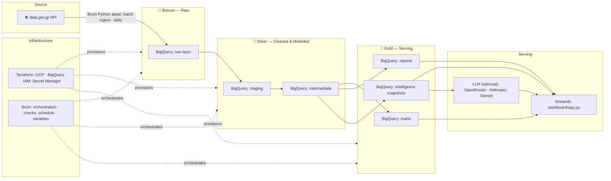
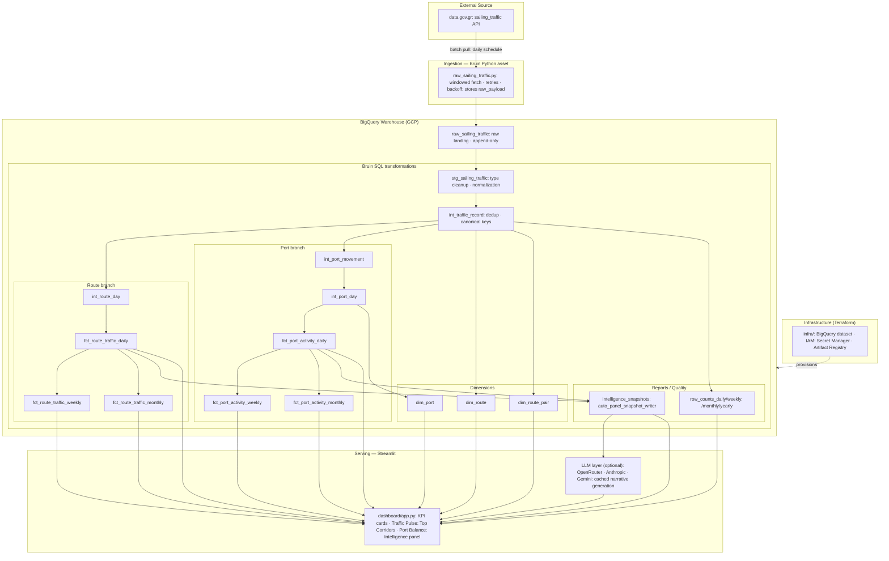

# Thalassa Architecture

## Medallion overview

## Detailed data flow

## Warehouse layers and key models

| Layer | Purpose | Main assets |
| --- | --- | --- |
| Raw landing | Append-only source landing with `raw_payload` preserved | `<THALASSA_BQ_DATASET>.raw_sailing_traffic` |
| Staging | Type cleanup, text normalization, safe casting | `<THALASSA_BQ_DATASET>.stg_sailing_traffic` |
| Intermediate | Canonical record grain and reusable aggregates | `<THALASSA_BQ_DATASET>.int_traffic_record`, `int_route_day`, `int_port_movement`, `int_port_day` |
| Marts | Dashboard-facing dimensions and fact tables | `dim_route`, `dim_route_pair`, `dim_port`, `fct_route_traffic_*`, `fct_port_activity_*` |
| Reports | Quality and profiling outputs | `row_counts_daily`, `row_counts_weekly`, `row_counts_monthly`, `row_counts_yearly` |
| Intelligence | Cached narrative layer for the UI | `intelligence_snapshots`, `auto_panel_snapshot_writer` |

## Batch pipeline details

The pipeline is defined in `pipeline/pipeline.yml` and is scheduled as `daily` starting from `2024-01-01`.

Runtime behavior is controlled with Bruin variables such as:

- `request_window_unit`
- `request_window_size`
- `request_max_retries`
- `request_retry_base_delay_seconds`
- `request_retry_max_delay_seconds`
- `request_failed_window_replay_passes`
- `request_failed_window_replay_delay_seconds`

The ingestion asset calls the public API in windows, retries transient failures, replays failed windows, and stores the raw JSON payload for traceability.

## BigQuery optimization and data quality

### Partitioning and clustering

The canonical warehouse models are optimized for analytic reads.

- Daily tables are partitioned by `service_date`
- Weekly tables are partitioned by `week_start`
- Monthly tables are partitioned by `year_month`
- Route-heavy tables are clustered by `departure_port`, `arrival_port`, and `route_pair_key`
- Port-heavy tables are clustered by `port_name`

This matters because the dashboard almost always filters by date and then slices by route or port.

### Data quality checks

Bruin checks are embedded directly in the assets.

Examples already implemented:

- `not_null`, `unique`, `positive`, and `non_negative` checks on key columns
- safe-cast checks for passenger and vehicle counts
- collision checks for `route_key` and `route_pair_key`
- accepted values checks for movement types

## Tech stack

| Layer | Tooling |
| --- | --- |
| Ingestion and orchestration | Bruin |
| Transformation | SQL + Bruin model metadata |
| Language runtime | Python 3.11+ |
| Warehouse | BigQuery |
| Cloud | GCP |
| IaC | Terraform |
| Dashboard | Streamlit + Altair/Vega-Lite |
| Secrets and auth | GCP ADC, optional service account file, Secret Manager |
| Optional intelligence layer | OpenRouter, Anthropic, or Gemini with BigQuery snapshot caching |
